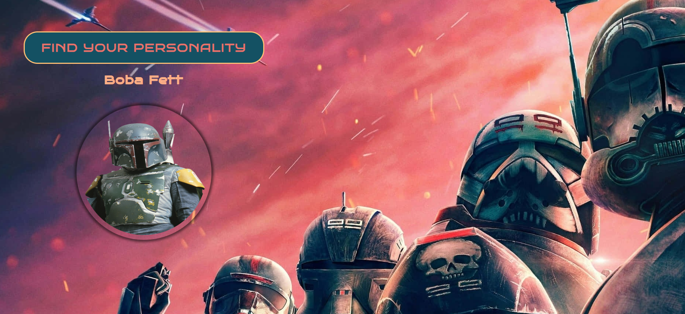

# Star Wars (JQuery)

This is a simple web page that allows you to find a Star Wars character's name and image by clicking a button.

## Preview

## Technologies Used

- HTML
- CSS
- jQuery

## How to Use

1. [Click here](https://kgogina.github.io/jQuery_starWars/) to open a webpage with the project. 
2. Click the "Find Your Personality" button to generate a random Star Wars character.
3. The character's name and image will be displayed.

## Credits

- Star Wars character data is fetched from the [Star Wars API](https://github.com/akabab/starwars-api).
- Background image sourced from [Unsplash](https://unsplash.com).

## License

This project is licensed under the [MIT License](LICENSE).

The project was created for learning purposes and does not represent a real company or offer real services. The images used in the project are for demonstration purposes and sourced from unsplash.com.

Feel free to explore and have fun with it!

